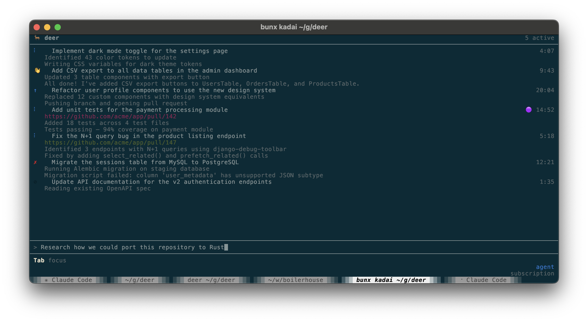
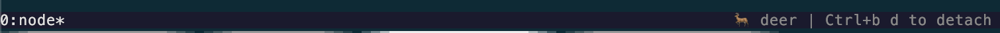

# deer

`deer` is what I consider the simplest tool for running multiple unattended `claude` instances safely.

If you want to parallelize `claude` agents, but don't like the complexity of agent orchestrators like `multiclaude` and `claude-squad`, `deer` may be for you.



## Goals

1. Quickly run and work with multiple `claude` instances at once.
2. Enable running with `--dangerously-skip-permissions` safely.
3. Use the users Claude Code subscription for everything.
4. Feel like `claude`.

---

## How it works

1. Launch `deer`.
2. Send prompts (each prompt is a worktree and agent isolated from filesystem and network).
3. Monitor agents and attach into them if necessary.
4. Press `p` to open a PR when finished.

---

## Installation

```sh
bunx @zdavison/deer install
```

### Supported platforms

| OS    | Arch  |
|-------|-------|
| macOS | x64, arm64 |
| Linux | x64, arm64 |

---

## Authentication

deer uses your Claude credentials to power the agent. It checks for credentials in this order:

1. `CLAUDE_CODE_OAUTH_TOKEN` environment variable
2. `~/.claude/agent-oauth-token` file (plain text token)
3. macOS Keychain (automatically extracted from Claude Code's stored credentials)
4. `ANTHROPIC_API_KEY` environment variable (fallback — API key)

If you have Claude Code installed and logged in, deer will use your subscription automatically on macOS with no extra setup.

Subscriptions are prioritized over API keys, so if you have both setup, `deer` will use your subscription.

---

## Usage

```sh
# Run from inside a git repo
cd your-project
deer
```

[Screenshot or demo GIF]

### Dashboard

#### Keyboard shortcuts

| Key | Action |
|-----|--------|
| [TBD] | Submit prompt |
| [TBD] | Cancel task |
| [TBD] | View task logs |
| [TBD] | ... |

### Attaching to a running agent

Each task runs in a named tmux session. You can attach directly to watch the agent in real time by pressing `Enter` while the agent is selected.

While attached, a `tmux` status bar is displayed with basic instructions on how to detach (`Ctrl+b`, `d`).



---

## Configuration

Configuration is layered. Later sources override earlier ones:

1. Built-in defaults
2. `~/.config/deer/config.toml` — global config
3. `deer.toml` in your repo root — repo-local config
4. CLI flags

### Global config (`~/.config/deer/config.toml`)

```toml
[defaults]
base_branch = "main"       # default base branch for PRs
timeout_ms = 1800000       # agent timeout in ms (default: 30 minutes)
setup_command = ""         # command to run before the agent starts

[network]
allowlist = [...]          # domains the sandbox can reach (replaces default list)

[sandbox]
runtime = "srt"            # ths is the only runtime for now
env_passthrough = []       # host env vars to forward into the sandbox
```

### Repo-local config (`deer.toml`)

Place this in your repo root — it is safe to commit.

You only need this if the defaults are not sufficient for you.

```toml
# Override the base branch for this repo
base_branch = "master"

# Run a setup command before the agent starts (e.g. install dependencies)
setup_command = "pnpm install"

# Allow additional domains (merged with the global allowlist)
[network]
allowlist_extra = ["npm.pkg.github.com"]

# Forward additional env vars into the sandbox
[sandbox]
env_passthrough_extra = ["NODE_ENV"]

# Inject extra credentials via the auth proxy
# [[sandbox.proxy_credentials_extra]]
# ...
```

See `deer.toml.example` for a full annotated example.

---

## Security model

`deer` runs each agent in an isolated sandbox using the [Anthropic Sandbox Runtime (SRT)](https://github.com/anthropic-ai/sandbox-runtime):

- **Filesystem**: the agent can only write to its git worktree; the rest of the filesystem is read-only or inaccessible.
- **Network**: outbound traffic is filtered through a domain allowlist; only explicitly permitted domains are reachable.
- **Credentials**: API keys and OAuth tokens never enter the sandbox — a host-side MITM proxy intercepts requests to credentialed domains and injects auth headers transparently. By default this applies to `claude` keys/OAuth tokens only, but you can add additional ones if necessary.
- **Environment**: only explicitly listed env vars are forwarded; host secrets are not leaked via the process environment.

---

## How PRs are created

Press `p` on an idle task to create a pull request.

This will generate a branch name, PR title, and PR description that describes the work done and push it to the repo.

Your PR template (`.github/PULL_REQUEST_TEMPLATE.md`) is conformed to automatically.

---

## Contributing

```sh
bun install
bun test
bun dev
```
